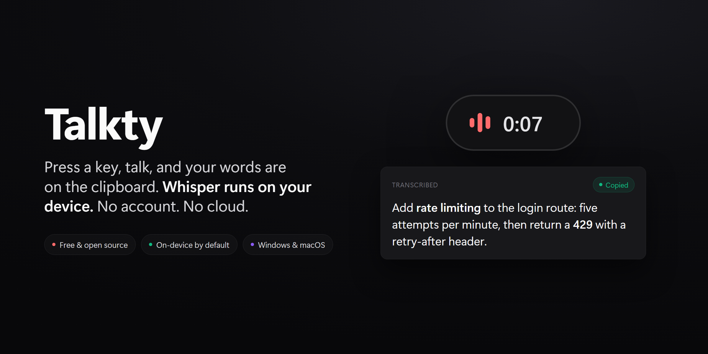
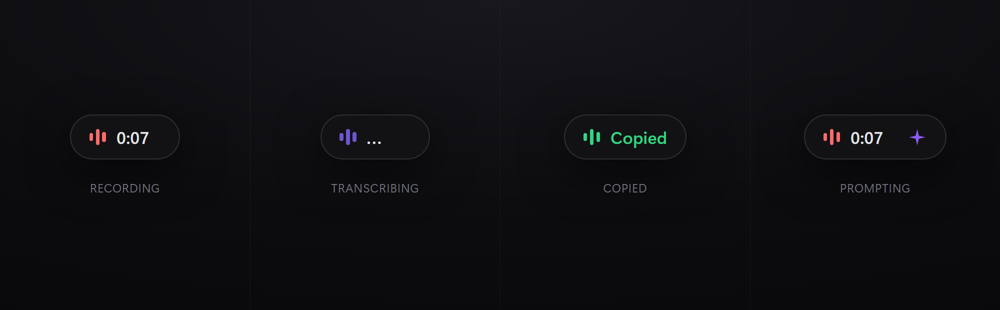
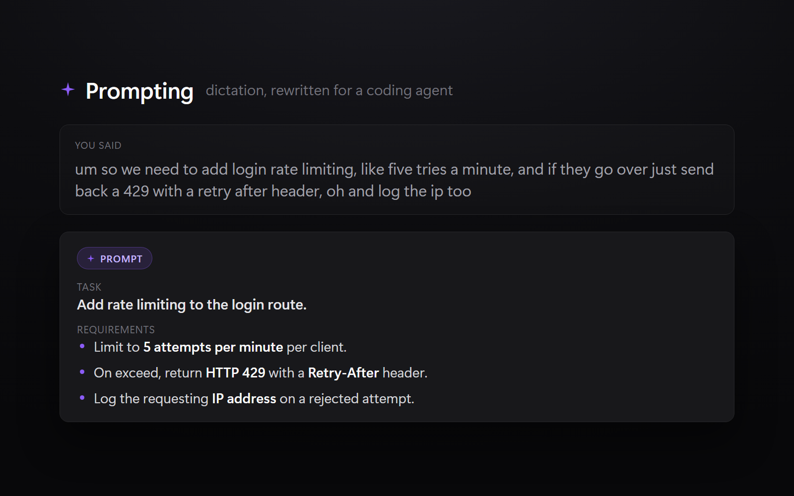

# Talkty

[](https://github.com/v2matosevic/Talkty/actions/workflows/ci.yml)
[](./LICENSE)
[](https://github.com/v2matosevic/Talkty/releases/latest)

[](https://github.com/v2matosevic/talkty-mac)

**Local speech-to-text for Windows, powered by Whisper.** Press a global hotkey,
speak, and your words land on the clipboard (and optionally type themselves at the
cursor). Transcription runs entirely on your device by default. No account, no
internet, no telemetry. Free and open source.



> On a Mac? There is a native Apple Silicon build too:
> **[talkty-mac](https://github.com/v2matosevic/talkty-mac)** (Metal accelerated,
> menu-bar app). Same idea, built the right way for each platform.

---

## Why

Most dictation tools send your microphone to someone else's server. That is a hard
no for a lot of what people actually say out loud: client work, half-formed ideas,
anything private. Talkty does the opposite. Whisper runs locally on your machine,
the audio is thrown away the moment it becomes text, and nothing leaves the device
unless you deliberately turn on a cloud feature.

It started as a tool for people who code by talking to an AI agent. Dictate a
rambling thought, get clean text, paste it into Claude Code, Cursor, or a terminal.
The optional Prompting mode goes one step further and rewrites that dictation into
a structured prompt. But none of that is required. At its core it is a fast, private
"hold a key, speak, get text" tool that works in any app.

---

## Features

- **Runs on your device.** Local Whisper transcription with optional GPU
  acceleration. Audio never leaves your machine and is discarded after transcription.
- **Press, speak, paste.** A global hotkey (default `Alt+Q`) starts and stops
  recording from any app. Text goes straight to the clipboard.
- **Type at the cursor.** Turn on auto-paste and the text inserts itself where you
  were typing. Works in editors, terminals, browsers, and chat apps.
- **GPU when you have one.** Auto-detects CUDA (NVIDIA), then Vulkan (AMD and Intel
  iGPUs), then falls back to CPU. A long clip transcribes in well under a second on a GPU.
- **Coding vocabulary built in.** A two-layer system biases Whisper toward developer
  terms and fixes the ones it still gets wrong (for example "cube cuddle" becomes
  `kubectl`, "post gres" becomes `PostgreSQL`). Fully editable in Settings.
- **Clean output.** Re-joins sentences split by a pause, strips Whisper
  hallucinations like `[MUSIC]` and "Thanks for watching", and normalizes punctuation.
- **Quiet in the tray.** Lives in the system tray, shows a small floating pill while
  recording, and ducks background audio so the mic hears you clearly.
- **Cloud transcription** *(opt-in)*. Route a take through OpenRouter models
  (GPT-4o Transcribe, Whisper Large V3, Qwen3 ASR, and more) when you want extra
  accuracy. Local stays the default.
- **Prompting mode** *(opt-in)*. Hover the recording pill, tap the sparkle, and your
  dictation is expanded into a structured prompt for a coding AI agent before it hits
  the clipboard.



---

## Install

1. Download the latest `TalktySetup-*.exe` from the
   [Releases page](https://github.com/v2matosevic/Talkty/releases/latest).
2. Run it. The installer is per-user and needs no admin rights. Windows
   SmartScreen may warn that the publisher is unknown (the app is not yet code
   signed). Choose **More info -> Run anyway**.
3. Launch Talkty. Open **Settings**, pick a model, and let it download.
4. Press **`Alt+Q`**, speak, press it again to stop. Your text is on the clipboard.

Upgrading is the same: run the new installer over the old one. Your settings stay put.

---

## Models

Models download on demand from HuggingFace into `%AppData%\Talkty\Models\`.

| Tier | Model | Size | Best for |
|------|-------|------|----------|
| Fast | Tiny | 75 MB | Quick notes, simple phrases |
| Balanced | Small | 466 MB | Everyday English dictation |
| Balanced | **Large v3 Turbo** | 1.6 GB | 99+ languages, the all-round pick (recommended) |
| Accurate | Large v3 | 3.1 GB | Maximum accuracy |

Quantized "Lite" variants are available for CPU-only machines (smaller and lighter
with a small accuracy trade). Pick any of them in **Settings -> Local models**.

---

## Cloud and Prompting (both opt-in)

Two features trade a little privacy for accuracy or convenience. Both are **off by
default** and both run through a single [OpenRouter](https://openrouter.ai) API key
that is stored **encrypted on your device** (Windows DPAPI), never in plain text.

- **Cloud transcription** sends one recording to a hosted model when you select a
  cloud model in Settings. Useful for long or difficult audio. Local Whisper stays
  the offline default the rest of the time.
- **Prompting** takes the words you just dictated and rewrites them into a clean,
  structured prompt for a coding agent (Claude Code, Cursor, Codex). It keeps every
  detail you said and drops the filler. If anything fails, it falls back to your raw
  transcription. See [docs/PROMPTING.md](./docs/PROMPTING.md) for the design and the
  model choices.



Leave both off and Talkty stays 100% local.

---

## Privacy

Local transcription is fully private:

- Audio never leaves your device.
- No internet connection is required for local models.
- Audio is discarded immediately after it is turned into text.
- No telemetry, no analytics, no account.

If you turn on Cloud transcription or Prompting, the relevant audio or text is sent
to OpenRouter for that one request. Your API key is encrypted on disk. Turn the
features off to stay offline.

---

## Settings

Open Settings from the gear icon or by right-clicking the tray icon.

| Setting | What it does |
|---------|--------------|
| Model | Which Whisper model to use, local or cloud |
| Microphone | Audio input device, with a built-in test |
| Hotkey | Global shortcut (default `Alt+Q`) |
| Language | Force a language or auto-detect |
| GPU | Use CUDA or Vulkan acceleration when available |
| Auto-paste | Insert the text at the cursor after transcription |
| Volume ducking | Lower other audio while recording |
| Vocabulary | Custom coding terms and text replacements |
| API key | OpenRouter key for Cloud and Prompting (encrypted) |

---

## Build from source

Requirements: .NET 8 SDK, Windows 10 or 11, and (for the installer) Inno Setup 6.

```bash
# Build and run
cd Talkty.App
dotnet build
dotnet run

# Release build (not single-file: Whisper needs the runtimes folder)
dotnet publish -c Release -r win-x64 --self-contained true

# Installer
"C:\Program Files (x86)\Inno Setup 6\ISCC.exe" installer\TalktySetup.iss
```

Run the tests with `dotnet test`. The version number lives in a single place,
`version.txt`, and flows into the assembly and the installer automatically.

---

## Project layout

```
Talkty.App/
  Models/        App settings, model profiles, vocabulary defaults
  Services/      Audio capture, transcription, hotkey, auto-paste, clipboard
    Engines/     Whisper (CUDA/Vulkan/CPU), SherpaOnnx, OpenRouter cloud
  ViewModels/    Recording state machine and settings logic (MVVM)
  Views/         Main window, settings, overlay pill, onboarding
Talkty.Tests/    xUnit tests for the text post-processing pipeline
installer/       Inno Setup script
docs/            PROMPTING.md and assets
```

A deeper tour of the architecture lives in [CLAUDE.md](./CLAUDE.md).

---

## Tech stack

.NET 8 and WPF, MVVM via [CommunityToolkit.Mvvm](https://github.com/CommunityToolkit/dotnet),
[Whisper.net](https://github.com/sandrohanea/whisper.net) for transcription,
[NAudio](https://github.com/naudio/NAudio) for capture, and
[Hardcodet.NotifyIcon.Wpf](https://github.com/hardcodet/wpf-notifyicon) for the tray.

---

## Contributing

Issues and pull requests are welcome. Start with [CONTRIBUTING.md](./CONTRIBUTING.md)
for how to build, what gets tested, and the conventions to match. Security policy and
how to report a vulnerability: [SECURITY.md](./SECURITY.md).

## License

[MIT](./LICENSE). Use it, fork it, ship it. Built by [Version2](https://version2.hr).
