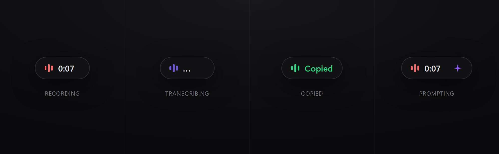

# Talkty

[](https://github.com/v2matosevic/Talkty/actions/workflows/ci.yml)
[](./LICENSE)
[](https://github.com/v2matosevic/Talkty/releases/latest)

[](https://github.com/v2matosevic/talkty-mac)

**Local speech-to-text for Windows, powered by Whisper.** Press a global hotkey,
speak, and your words land on the clipboard (and optionally type themselves at the
cursor). Transcription runs entirely on your device by default. No account, no
internet, no telemetry. Free and open source.

The current source includes the upcoming **1.4.0** changes. See the
[release preparation record](docs/RELEASE-1.4.0.md) for installation and draft-release status.


> On a Mac? There is a native Apple Silicon build too:
> **[talkty-mac](https://github.com/v2matosevic/talkty-mac)** (Metal accelerated,
> menu-bar app). Same idea, built the right way for each platform.

---

## Why

Most dictation tools send your microphone to someone else's server. That is a hard
no for a lot of what people actually say out loud: client work, half-formed ideas,
anything private. Whisper runs locally on your machine,
new local recordings are held in memory, and no transcription data leaves the device
unless you deliberately turn on a cloud feature.

It started as a tool for people who code by talking to an AI agent. Dictate a
rambling thought, get clean text, paste it into Claude Code, Cursor, or a terminal.
The optional Prompting mode goes one step further and rewrites that dictation into
a structured prompt. But none of that is required. At its core it is a fast, private
"hold a key, speak, get text" tool that works in any app.

---

## Features

- **Runs on your device.** Local Whisper transcription with optional GPU
  acceleration. New local recordings stay in memory on your machine.
- **Press, speak, paste.** A global hotkey (default `Alt+Q`) starts and stops
  recording from any app. Text goes straight to the clipboard.
- **Type at the cursor.** Turn on auto-paste and the text inserts itself where you
  were typing. Works in editors, terminals, browsers, and chat apps.
- **GPU when you have one.** Vulkan acceleration works out of the box on NVIDIA, AMD
  and Intel GPUs, with CPU fallback. NVIDIA users can install the optional CUDA pack
  from Settings for maximum speed — it's a separate download so the installer stays small.
- **Less waiting after a pause.** Talkty can recognize the full take while you pause,
  then reuse it only if the final audio matches exactly. CUDA uses faster attention.
  These preserve the selected model and full-recording context; timing depends on
  your speech, hardware and provider. [Measured results](docs/TRANSCRIPTION-LATENCY-2026-09-22.md).
- **Coding vocabulary built in.** A two-layer system biases Whisper toward developer
  terms and fixes the ones it still gets wrong (for example "cube cuddle" becomes
  `kubectl`, "post gres" becomes `PostgreSQL`). Fully editable in Settings.
- **Clean output.** Re-joins sentences split by a pause, strips Whisper
  hallucinations like `[MUSIC]` and "Thanks for watching", and normalizes punctuation.
- **Quiet in the tray.** Lives in the system tray, shows a small floating pill while
  recording, and ducks background audio so the mic hears you clearly.
- **Light on your PC.** Low resource use while idle, and the speech model's memory
  (up to several GB for the large models) is freed after 15 minutes of inactivity —
  it reloads automatically while you speak, so you never notice.
- **Cloud transcription** *(opt-in)*. Route a take through OpenRouter models
  (GPT-4o Transcribe, MAI-Transcribe 2, Whisper Large V3, Qwen3 ASR, and more) when you want extra
  accuracy. Local stays the default.
- **Recover failed cloud recordings.** Failed takes stay encrypted on your PC with
  Retry and Discard controls, even after restarting Talkty. Pick an automatic backup
  model in Settings to handle temporary cloud failures.
- **Prompting mode** *(opt-in)*. Enable it in Settings > Cloud & Prompting, and your
  dictation is expanded into a structured prompt for a coding AI agent before it hits
  the clipboard.
- **Command mode** *(optional integration)*. A separate shortcut sends a spoken
  instruction to a compatible local command service and shows its response on the
  pill. The service is not bundled; ordinary dictation needs no service.
  [Integration and privacy](docs/COMMAND-MODE.md).



---

## Install

1. Download the latest `TalktySetup-*.exe` from the
   [Releases page](https://github.com/v2matosevic/Talkty/releases/latest).
2. Run it. New per-user installations need no admin rights; upgrading an existing
   all-users installation may prompt for administrator approval. Windows
   SmartScreen may warn that the publisher is unknown (the app is not yet code
   signed). Choose **More info -> Run anyway**.
3. Launch Talkty. Open **Settings**, pick a model, and let it download.
4. Press **`Alt+Q`**, speak, press it again to stop. Your text is on the clipboard.

Upgrading is the same: run the new installer over the old one. Your settings stay put.

---

## Models

Models download on demand from HuggingFace into `%AppData%\Talkty\Models\`.

| Tier | Model | Size | Best for |
|------|-------|------|----------|
| Fast | Tiny | 75 MB | Quick notes, simple phrases |
| Balanced | Small | 466 MB | Everyday English dictation |
| Balanced | **Large v3 Turbo** | 1.6 GB | 99+ languages, the all-round pick (recommended) |
| Accurate | Large v3 | 3.1 GB | Maximum accuracy |

Quantized "Lite" variants are available for CPU-only machines (smaller and lighter
with a small accuracy trade). Pick any of them in **Settings -> Local models**.

---

## Cloud and Prompting (both opt-in)

Two features trade a little privacy for accuracy or convenience. Both are **off by
default** and both run through a single [OpenRouter](https://openrouter.ai) API key
that is stored **encrypted on your device** (Windows DPAPI), never in plain text.

- **Cloud transcription** sends one recording to a hosted model when you select a
  cloud model in Settings. Useful for long or difficult audio. Local Whisper stays
  the offline default the rest of the time. The recommended cloud model is
  Microsoft's MAI-Transcribe 2: inexpensive, fast, and it leaves out filler
  words. Your vocabulary words are sent to it as spelling hints. It covers 60
  languages but not Croatian or Serbian.
- **Cloud backup** automatically tries a second model if the primary is busy or
  temporarily unavailable. Choose it under **Settings -> Cloud & Prompting**;
  Qwen3 ASR Flash is the default, and **Off** disables it. Backup requests also cost
  per use. An identical model or a model that does not support your selected language
  is skipped. Failed recordings appear in Talkty with **Retry** and **Discard**.
  Retry uses your current primary model and copies the result if enabled; it does
  not auto-paste into an old target window. Qwen3 ASR 1.7B is also available as a
  separate cloud model.
- **Prompting** takes the words you just dictated and rewrites them into a clean,
  structured prompt for a coding agent (Claude Code, Cursor, Codex). It keeps every
  detail you said and drops the filler. If anything fails, it falls back to your raw
  transcription. See [docs/PROMPTING.md](./docs/PROMPTING.md) for the design and the
  model choices.


Leave both off and Talkty stays 100% local.

For the shortest plain-dictation delay, leave Prompting off. Optional prompt planning
and fidelity checks are documented in [planning](docs/PROMPT-PLANNING.md) and
[fidelity](docs/PROMPT-FIDELITY.md); they can add paid text requests when configured.
Planning is an advanced setting and defaults off.

**Start transcription during pauses** is enabled by default under Settings > Behavior.
With a cloud model selected, audio can be sent before you press Stop. At most one
extra early pass may be billed, even if you cancel or continue speaking. Disable this
setting to send cloud audio only after stopping.

---

## Privacy

Local transcription is fully private:

- Audio never leaves your device.
- No internet connection is required for local models.
- New local recordings are held in memory; transcripts can be stored in local history and logs.
- No telemetry, no analytics, no account.

If you turn on Cloud transcription or Prompting, the relevant audio or text is sent
to OpenRouter and its model providers. A cloud backup can send the same recording
to another provider when the primary fails. Your API key is encrypted on disk.
Cloud recordings are saved under `%AppData%\Talkty\Recovery`, encrypted with Windows
DPAPI for your Windows account, at Stop before the final upload. An early request
during a pause can precede that save. The recovery copy is removed after
the transcript is saved to history or when you choose Discard. Failed takes survive
restarts; switching to a local model does not delete them. Turn cloud features off
to keep new transcription requests offline.

History and diagnostic logs stay on your PC; logs may contain dictated text.
Model downloads and update checks use the network. Optional command mode passes
transcript and window information to the configured local service, which controls
any further actions or network access.

---

## Settings

Open Settings from the gear icon or by right-clicking the tray icon.

| Setting | What it does |
|---------|--------------|
| Model | Which Whisper model to use, local or cloud |
| Microphone | Audio input device, with a built-in test |
| Hotkey | Global shortcut (default `Alt+Q`) |
| Language | Force a language or auto-detect |
| GPU | Use CUDA or Vulkan acceleration when available |
| Auto-paste | Insert the text at the cursor after transcription |
| Volume ducking | Lower other audio while recording |
| Vocabulary | Custom coding terms and text replacements |
| API key | OpenRouter key for Cloud and Prompting (encrypted) |
| Cloud backup | Automatic fallback model for temporary cloud failures, or Off |
| Transcription during pauses | Prepare a whole-take result early; cloud can bill one extra pass |
| Prompting | Rewrite ordinary dictation into an agent prompt; adds a paid request and delay |
| Command mode | Separate shortcut for a configured local command service; off by default |

---

## Build from source

Requirements: .NET 8 SDK, Windows 10 or 11, and (for the installer) Inno Setup 6.

```powershell
# Build and run
dotnet build Talkty.App
dotnet run --project Talkty.App

# Checked release build and installer, in a fresh publish directory
pwsh -File installer/build.ps1
```

Run the tests with `dotnet test`. The version number lives in a single place,
`version.txt`, and flows into the assembly and the installer automatically.
The script keeps native runtime files alongside the executable, verifies the
payload, and writes SHA-256 hashes. See [the release guide](installer/RELEASE.md).

---

## Project layout

```
Talkty.App/
  Models/        App settings, model profiles, vocabulary defaults
  Services/      Audio capture, transcription, hotkey, auto-paste, clipboard
    Engines/     Whisper (CUDA/Vulkan/CPU), SherpaOnnx, OpenRouter cloud
  ViewModels/    Recording state machine and settings logic (MVVM)
  Views/         Main window, settings, overlay pill, onboarding
Talkty.Tests/    xUnit tests for recording, output, cloud recovery, prompts and UI
installer/       Inno Setup script
docs/            PROMPTING.md and assets
```

A deeper tour of the architecture lives in [docs/ARCHITECTURE.md](./docs/ARCHITECTURE.md).

---

## Tech stack

.NET 8 and WPF, MVVM via [CommunityToolkit.Mvvm](https://github.com/CommunityToolkit/dotnet),
[Whisper.net](https://github.com/sandrohanea/whisper.net) for transcription,
[NAudio](https://github.com/naudio/NAudio) for capture, and
[Hardcodet.NotifyIcon.Wpf](https://github.com/hardcodet/wpf-notifyicon) for the tray.

---

## Contributing

Issues and pull requests are welcome. Start with [CONTRIBUTING.md](./CONTRIBUTING.md)
for how to build, what gets tested, and the conventions to match. Security policy and
how to report a vulnerability: [SECURITY.md](./SECURITY.md).

## License

[MIT](./LICENSE). Use it, fork it, ship it. Built by [Version2](https://version2.hr).
