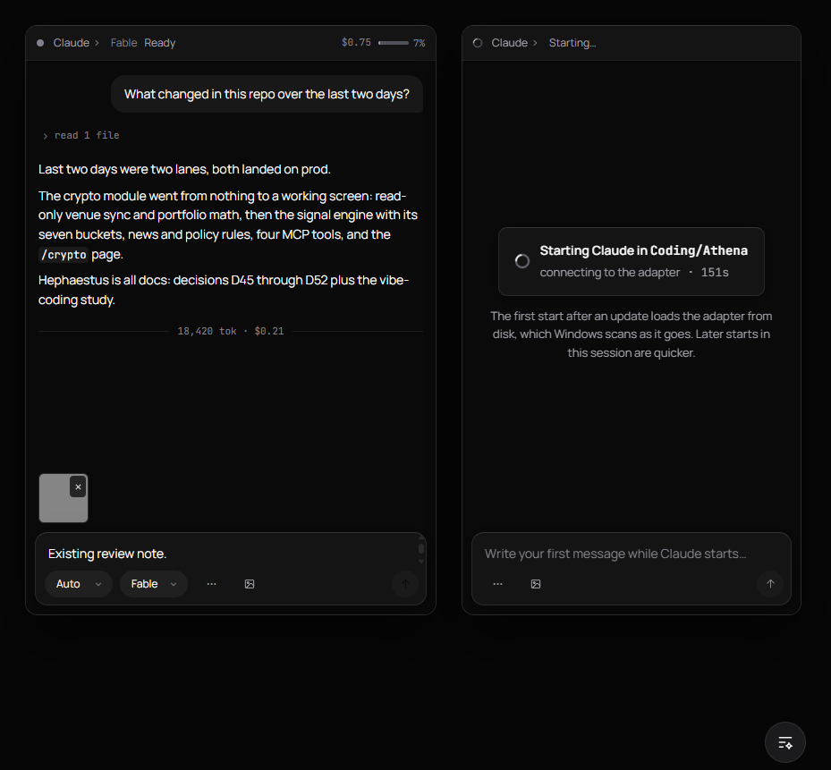
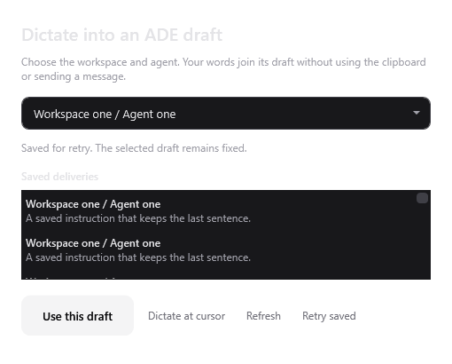
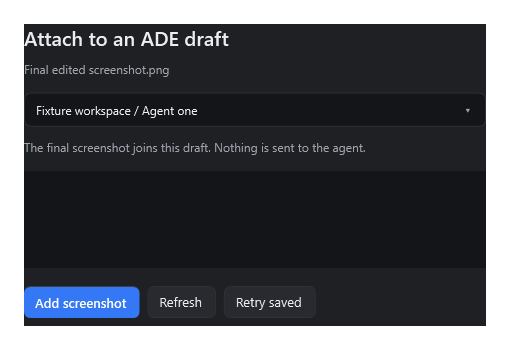

# Capture hub: first implementation

Implemented locally on 3 October 2026 after Marko approved the October 2 proposal. The first path connects Talkty and WinSnipper to a chosen ADE agent draft. Application installations and the public ADE 0.0.108 update are unchanged.

## What works in source

- Talkty's destination button selects a named workspace/agent or ordinary dictation at the cursor. Each take freezes its destination at recording start, preserves complete recognition/Prompting output, and stages it without touching the clipboard or submitting a turn.
- WinSnipper offers Attach to ADE from the edited screenshot, screenshot thumbnail and capture history. Editor export snapshots the final composite, including redactions, without changing save/clipboard behavior. PNG encoding/upload runs off the UI thread. Video attachment is hidden.
- ADE verifies companion identity, exact destination, operation ID, screenshot hash/size and PNG decoding. It owns the accepted image bytes, keeps existing composer text, displays a preview and expands the composer to show the incoming instruction. No turn is sent until the user sends it.
- Replayed operations do not duplicate a draft. A screenshot or instruction arriving during Send remains for the next draft. Durable submitting state precedes the send, and interrupted submission never reappears as an automatic staged retry. Replacement conversations do not inherit old captures; the same provider conversation can recover an unsent capture after resume.
- Both Windows providers keep uncertain handoffs encrypted with current-user DPAPI in their own CaptureOutbox. Retry uses the same frozen payload/ID. Ordinary local speech and clipboard use remain independent of the capture receiver.
- Hermes voice commands now claim stable operation IDs before execution, retain durable receipts across restart, reject changed payloads and expose receipt lookup. Talkty reconciles server/connection failures instead of blindly resending a possibly executed action. Wrong or unreadable receipts remain uncertain.

Contract: [ADE capture companions](../../Athena/app_tracker/apps/ade/docs/CAPTURE-COMPANIONS.md). Discovery reuses [Version2's local-services registry](../../Athena/docs/ecosystem/local-services.md); it does not borrow agent-session tokens or expose shell execution.

Committed source: Talkty `2e8ffe1`, ADE `3f029e89`, WinSnipper `1e4b9e8` (preserving reliability baseline d802e85), and Hermes/discovery `dc02d887b`. These are local source commits, not published/installed packages.

## Evidence

| Check | Result and scope |
| --- | --- |
| Talkty Release build | Zero application warnings/errors. Test-source warnings are the six pre-existing nullable/blocking warnings. |
| Full Talkty suite | 398 tests passed, including the real recording/output pipeline, frozen targets, no clipboard/paste for direct delivery, encrypted failure recovery, receipt matching and small-window layout. |
| ADE frontend gates | Strict Svelte check: zero errors/warnings. Full suite: 2,632 passed, three existing skips. Prettier passed. Production frontend build passed; final source verification is recorded in the handoff. |
| Native capture store/HTTP | Eight focused tests passed: actual authenticated loopback requests, browser-origin refusal, wrong owner/session, media hash/decoding, replay/restart, replacement/resumed conversations and submitting-state recovery. |
| Native ADE inventory | Real registry/checkpoint test passed for named ACP targets, generic-shell exclusion, main/pop-out ownership, renderer replacement and ended sessions. |
| Native static gates | Cargo formatting and all-target/all-feature strict Clippy passed on Windows before final handoff. Native Mac execution/installation was not performed. |
| Hermes voice | 29 focused operation/runtime checks passed, including the real HTTP endpoint. The full Hermes suite also completed with exit 0 using the dot reporter; no model requests were needed. |
| Real C# → Rust boundary | `tools/Talkty.CaptureCheck` sent full text and synthetic PNG bytes through the actual native receiver. The text and SHA-256 matched, repeated operations left one record each, and the provider outbox cleared. It uses only an explicit isolated fixture directory, never installed ADE. |
| Browser behavior | Actual AgentTile preview preserved existing text, showed one screenshot, kept the full instruction unchanged on replay and made zero automatic submissions. An explicit fixture Send contained the PNG image payload, transitioned submitting/submitted once, and retained a second instruction arriving during that send. |
| WinSnipper | Isolated lite/OCR builds passed with zero warnings/errors. Existing hotkey and history render/regression checks passed in the combined source. Its reliability baseline d802e85 remains intact. |
| UI inspection | Talkty destination/recovery controls and WinSnipper's dark capture picker were rendered offscreen and inspected; the actual ADE composer was inspected in the browser. No input or windows were driven on Marko's desktop. |

The browser uses the existing dev-only tile preview and controlled ports; its fake agent never launches a CLI or spends inference. The provider fixtures use synthetic text/pixels, not microphone recordings or private screenshots. The standalone Rust fixture exits on its own after 60 seconds. No installed app or daemon was stopped.

## Controls and recovery

1. In an updated ADE, open the receiving agent tile.
2. In WinSnipper, attach a final screenshot to that named workspace/agent.
3. In Talkty, choose that same draft, then use the ordinary recording shortcut. The entire take joins the draft.
4. Review the preview/text and send from ADE.

Use Dictate at cursor to return to ordinary Talkty behavior. If the receiver cannot verify delivery, open the provider's capture window and select Retry saved. A retry retains its original destination rather than following the current focus. Do not use a second new command to repeat an action whose outcome is uncertain.

Accepted images reside in ADE's capture-inbox; provider cleanup cannot break them. Stored captures whose original destination/conversation is unavailable remain on disk without automatic retargeting. The current API does not offer a retarget/recovery panel for those older receiver entries. Provider outboxes hold failed/uncertain handoffs, not a general capture history.

## Delivery and remaining boundaries

This is the accepted first implementation slice, not all eight roadmap items. Athena Desktop conversation delivery, Work Hub evidence uploads, generic-terminal support, visual video processing, workspace recognition profiles, searchable dictation history and coordinated packaging remain separate work. Existing `Athena-7o1s` and `Athena-ovqe` retain their broader discovery/voice-command work; this receiver does not silently drain the old command-execution channel.

Work Hub 8111 records the completed source retry repair; Athena-e1r5 records the completed capture implementation. Linked delivery task Athena-dkxi retains package preparation and native installed/owner acceptance. Installation and owner acceptance are not implied by source/build tests. Running Talkty 1.4.0, WinSnipper and ADE remain their previous installed builds. A combined update is required before the new controls can work in daily use; closing apps/agents or stopping their processes still requires Marko's explicit approval under his supplied AGENTS instructions.

No public updater/version notice, hosting configuration, global installation or shell/PATH setting was changed. No private audio/screenshot was replayed or uploaded, and no paid model call was made. The temporary Vite verification server on port 50123 remains available until its cleanup is authorized.
