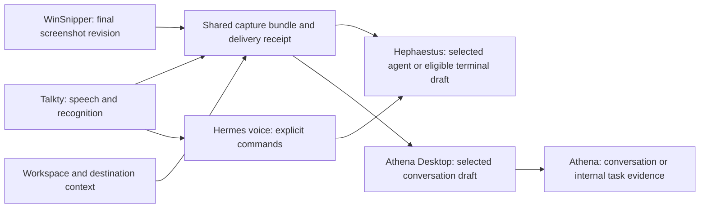

# Talkty improvements and the shared desktop hub

Prepared for Marko on 2 October 2026. Review and proposal only. This document does not describe an implemented integration or an installed update.

## Recommendation

Connect Talkty and WinSnipper to a shared capture workflow in Hephaestus, with the same destination picker and draft handling available in Athena Desktop. Talkty supplies the spoken explanation, WinSnipper supplies the screenshot, Hephaestus receives coding work, and Athena receives business conversations and durable task evidence.

The first useful outcome is: **capture a problem, explain it aloud, and see the final image and complete instruction together in the chosen workspace's unsent draft.** It must survive a workspace switch and a failed handoff without losing or duplicating either part.

Confidence is **high** that the existing architecture can support this. Confidence in the product order below is **moderate**; its benefit has not been measured in daily use. Build the shared workflow before considering a combined installer or moving native recording engines into another application.

## What the current app actually needs

The running Windows Talkty is 1.4.0, with assembly source stamp `9a9f7b4c7ce38a6027550d863d45e2b50d02064d`. The reviewed checkout is `dd77fed6cd319d9771bf15109038331cf95d3d40`. Its saved setup selects MAI-Transcribe 2, Qwen Flash backup, English, auto-paste, pause recognition and command mode. Prompting is off. The local history contains 50 entries.

Read-only analysis of the live session log, `talkty_2026-09-28_15-18-32.log`, at **18:59:18 on 2 October** found:

| Observation | Result | Implication |
| --- | --- | --- |
| Successful clipboard deliveries with recorded timings | 563; median 822 ms; 95th percentile 2,302 ms | Typical delivery is already reasonably fast. |
| Recorded paste attempts | 563; median 846 ms; 95th percentile 2,402 ms; maximum 25,814 ms | Investigate slow outliers rather than promising a universal speed multiplier. |
| Paste outcomes | 562 `Pasted`, one `NoTarget` | These are Talkty's input-injection outcomes, not proof that the intended composer received the right text. |
| Pause recognition | 202 recordings attempted an early pass; seven reused it | Only about 3.5% of recordings that attempted early work reused it. Measure unnecessary work and billing before making this more aggressive. |
| Other completed early-recognition cycles | 362 ran no early pass | Continuous speech and short pauses need the ordinary full pass. |
| Warning/error lines | Five HTTP 429 lines, two failed/empty-transcription lines, one long-audio warning and one invalid target | These are log-line counts, not separate incident counts. |

The log read used `FileShare.ReadWrite`: Windows reported the active file as zero bytes, but the reader obtained about 3 MB. No personal transcript or audio was replayed, uploaded or copied into this report. Timings cover this one installed session and its selected workload; they are not a controlled benchmark or an accuracy score.

Marko already chose full-recording accuracy over phrase splitting. Keep that constraint. See [the latency decision and measurements](TRANSCRIPTION-LATENCY-2026-09-22.md).

## Improvements in priority order

| Order | Improvement | What changes for Marko | Basis and confidence |
| --- | --- | --- | --- |
| 1 | Reliable direct delivery into a selected workspace draft | Speech reaches the intended agent or Athena thread even when windows move; the clipboard remains available for screenshots and other work. | Native ADE drafts and attachment queues already exist. New companion routing is required. Feasibility high; daily benefit unmeasured. |
| 2 | Screenshot plus spoken explanation as one capture bundle | Snip a defect, describe the fix, then review one draft containing both. Select the screenshot or revision explicitly. | Aligns with [WinSnipper's proposal](../../WinSnipper/docs/ECOSYSTEM-INTEGRATION.md). Integration is proposed, not built. |
| 3 | Workspace vocabulary and deliberate corrections | Recognize names such as Hephaestus, Athena and WinSnipper, the current client, and selected code identifiers without maintaining one huge global list. | Talkty already has bounded vocabulary builders and editable replacements. Workspace context is the missing input. High feasibility. |
| 4 | Searchable, useful dictation history | Find an instruction by text/workspace, correct it, recover it, and return to its screenshot or destination. Distinguish dictation, generated prompt and command result. | Current history is capped at 50 entries and lacks workspace, destination and delivery metadata. High confidence in the gap. |
| 5 | A shared controls surface | See microphone, model, local/cloud mode, shortcut ownership, provider availability and pending deliveries together in ADE/Desktop. | Existing app settings remain the authorities; the hub reads capabilities and calls narrow settings operations. Moderate implementation complexity. |
| 6 | Better English/Croatian/German workflows | Choose a per-workspace or quick language profile instead of changing global settings every time. Preserve technical names and deliberate mixed-language speech. | Language selection already exists. Add profiles and qualify actual speech; do not claim a new language capability. Recognition improvement unknown until measured. |
| 7 | Fewer wasted early calls and fewer long waits | Spend background recognition work where it helps, surface provider cooldowns and retain a take during failure. | Low early-result reuse and the latency tail are measured. Keep exact-final-audio equality; any improvement magnitude is unknown. |
| 8 | Recover local failures and control retained speech | Optional encrypted recovery for failed local takes, configurable history retention, and diagnostic logs that avoid retaining full dictation by default. | Cloud recovery already exists. Local takes do not enter its durable store automatically; normal Info logs currently contain full transcribed/replaced text. High confidence in these source findings. |

For corrections, offer an explicit “remember this spelling in this workspace” action. Do not silently convert every occurrence of an ordinary word into a product name or learn from an unreviewed model rewrite. Rank workspace additions ahead of the generic catalog while retaining the current provider limits and language safeguards. Sources: [VocabularyPromptBuilder](../Talkty.App/Services/VocabularyPromptBuilder.cs), [settings](../Talkty.App/Models/AppSettings.cs), [history persistence](../Talkty.App/Services/SettingsService.cs), [recording/output pipeline](../Talkty.App/ViewModels/MainViewModel.cs).

Keep ordinary dictation fast. Prompting remains an explicit choice, and command mode remains an explicit action route. Automatic voice-stop, phrase splitting, always-visible live transcription and an LLM rewrite on every take do not follow from this brief.

## What already connects, and what is missing

| Existing seam | Verified state | Next useful change |
| --- | --- | --- |
| Talkty → Hermes voice | Alt+W posts text and captured window identity to `hermes-voice`; the pill follows command/goal outcomes. | Add caller-stable operation IDs and reliable reconciliation before expanding actions. |
| Local service discovery | Hermes publishes a service record; Talkty consumes it. A live record exists on this machine. | ADE/Desktop expose bounded companion capabilities using the same discovery convention. Existing issue: `Athena-7o1s`. |
| Hermes → ADE voice commands | Hermes writes requests to `channels/voice-command`; ADE's collector scans spools belonging to registered terminal owners. The reserved channel is not registered/consumed. | Complete this explicit external-command route with companion authority and owner-aware routing. Existing issue: `Athena-ovqe`. |
| ADE conversation drafts | Agent tiles preserve draft text and support image/file attachments and previews. | Stage a capture bundle through those native queues instead of synthesizing a clipboard paste. |
| ADE terminal inputs | File drops and managed prompt submission have distinct routes and readiness/receipt handling. | Allow only eligible coding-agent input surfaces; refuse a generic shell or a busy/unknown target. |
| Athena Desktop chat | Its paired API already supports conversation media and checks server attachment capability. | Stage text/media in the selected thread, persist the pending bundle, then use its existing Send action. |
| WinSnipper | Captures, edits, exports and drags files; its peer is adding local capture history in this pass. | Reuse the final capture revision and the companion contract in its proposal. No integration implementation was reported by that lane. |

Sources: [Talkty command contract](COMMAND-MODE.md), [VoiceEndpointResolver](../Talkty.App/Services/VoiceEndpointResolver.cs), [local-services contract](../../Athena/docs/ecosystem/local-services.md), [Hermes ADE handler](../../Athena/hermes/src/voice/handlers/ade.mjs), [ADE collector/owners](../../Athena/app_tracker/apps/ade/src-tauri/src/window_sessions.rs), [AgentTile](../../Athena/app_tracker/apps/ade/src/lib/ade/AgentTile.svelte), [terminal attachment queues](../../Athena/app_tracker/apps/ade/src/lib/ade/terminalsStore.svelte.ts), [Athena conversation API](../../Athena/app_tracker/apps/desktop/src/lib/shared/api/agent-chat.ts).

The installed Hephaestus executable identifies as 0.0.104. Newer source and published-package records do not prove that a new integration is installed. Athena Desktop's Windows version-resource fields are `0.0.0`; they do not establish its application release. No live draft, command or attachment was injected during this review.

## One hub, with clear ownership

Hephaestus is the recommended main hub while coding. Athena Desktop exposes the same capture controls for business conversations and work context. Native providers continue owning microphone capture, speech models, screen capture and editing. Hermes provides the existing discovery/routing foundation; Athena owns the business records. A shared design does not require every feature to run in one process.

The first controls surface should be small: destination, current transcript/image, pending state, and access to relevant settings. Keep advanced engine settings in Talkty and capture settings in WinSnipper, reachable from the hub. A shortcut map should identify the actual owning app and conflicts, retaining the established shortcuts rather than registering a second owner for them.

This respects the existing [unification direction and September 4 hold on retiring Athena Desktop](../../Athena/app_tracker/docs/UNIFICATION.md). This review does not reopen that retirement decision.

Tauri supports bundling and launching external native executables through its sidecar mechanism. That makes later coordinated packaging technically possible, but packaging Talkty's native runtimes/models and maintaining independent updates still needs a design and real installer checks. [Tauri sidecar documentation](https://v2.tauri.app/develop/sidecar/), inspected in the browser on 2 October. This is an architectural inference, not a tested combined installer.

## The shared companion contract

Use WinSnipper's proposed capture/draft contract for both providers. Add the transcript to the same record rather than introducing another competing bridge.

| Fact | Required representation |
| --- | --- |
| Capture identity | Bundle ID, provider capture ID, explicit revision, creation time, content hash and declared media size/type. |
| Speech | Complete transcript, optional deliberately generated prompt, language/model provenance and explicit dictation/prompt/command mode. |
| Destination | App, native workspace ID, owner window, agent/eligible terminal or Athena conversation ID; repository ID/slug for portable association. |
| Context | Source, timestamp and freshness. Freeze the chosen destination for the operation; a later focus change cannot redirect it. |
| Delivery | Stable caller operation ID, payload hash and durable receipt. Reusing an ID with the same payload returns the existing receipt; a different payload is refused. |
| Media ownership | Receiver-owned bytes copied from the final edited/redacted export before acknowledging delivery. Source cleanup cannot break an accepted draft. |
| States | Captured, staged, submitted, failed or uncertain. A saved image is not a submitted message, and a command acknowledgement is not completed work. |

Expose only destination listing, fresh context, draft staging and receipt lookup to capture companions. Use a separate companion identity with narrow capabilities; never copy an agent-session token or offer arbitrary shell execution. Preserve existing draft text and attachments. If the tracked workspace and the focused ADE workspace differ, show the conflict and let Marko choose a destination.

Extend [the existing service-record convention](../../Athena/docs/ecosystem/local-services.md) for discovery. It currently describes loopback HTTP services. WinSnipper's proposed Windows named pipe and a future Mac Unix socket need an explicit versioned transport field/extension; an HTTP `url` record cannot describe a pipe without changing the contract. Choose and qualify one common transport before implementation. Both can retain the same destination, payload and receipt semantics.

Ordinary draft staging does not submit a turn. An explicit spoken action uses Hermes's existing command authorization, then the receiver's supported action path. Closing apps/agents/processes and the other existing hard stops continue requiring Marko's explicit approval. A transport timeout never grants permission to resend an action.

## Correctness issue to fix before expanded voice actions

**High confidence, source-level finding:** Talkty currently maps HTTP 500 and `HttpRequestException` to `NotReached`, and the recording pipeline retries a `NotReached` command once. Those failures can occur after the server received or executed the action. Hermes generates a fresh random request ID for each dispatch, and Talkty sends no stable operation ID. The second request can therefore repeat the action.

Evidence: [client classification](../Talkty.App/Services/VoiceCommandService.cs), [pipeline retry](../Talkty.App/ViewModels/MainViewModel.cs), `AServerErrorIsNotReached` in [the current tests](../Talkty.Tests/VoiceCommandServiceTests.cs), [Hermes server response/catch](../../Athena/hermes/src/voice/server.mjs), and [runtime-generated request IDs](../../Athena/hermes/src/voice/runtime.mjs). Timeouts/cancellation already have a separate `Uncertain` result. Jev's short suppression window is not a durable operation receipt.

No duplicate production action was reproduced. Record: agent-coord issue `i-8ba35006`; **Work Hub task 8111, “Prevent duplicate Talkty voice actions after an uncertain reply,”** created in Backlog. Qualify the repair with a server that performs one harmless fixture action and then loses the response/returns 500: reconciliation and replay must still produce one action.

## Delivery order and observable finish

1. Complete the delivery foundation. Resolve task 8111; agree on companion identity, discovery transport and stable receipts. Reuse `Athena-7o1s` and `Athena-ovqe` for their existing missing seams. Finish: no blind retry after possible execution, wrong-service refusal, and an explicitly routed ADE command with a real receipt.
2. Deliver one useful capture path. WinSnipper's final PNG plus Talkty's complete transcript enters a selected ADE draft. Finish: correct image preview and exact transcript, preserved existing draft, one receipt, no submitted turn, and recovery after a failed handoff or workspace switch.
3. Add workspace recognition and history. Feed bounded workspace terms; offer deliberate correction and searchable, provenance-aware capture history. Finish: selected names/numbers/prohibitions remain intact, and an old bundle can be found and reopened with its destination and status.
4. Extend to Athena Desktop. Reuse its conversation/media pipeline. Finish: the chosen thread receives one bundle; failed sends retain it; reconnect does not submit it automatically.
5. Add internal Work Hub evidence and larger media deliberately. Private task evidence needs its own API/access rules. Visual video analysis needs an actual visual-video path or storyboard. Ship those separately from PNG delivery.
6. Then improve measured tails and packaging. Evaluate early-pass reuse/cost using fresh aggregate timing data, qualify language profiles, and consider coordinated updates/installation. Any claimed speed or accuracy improvement needs a representative before/after result.

The Athena source currently classifies MP4/WebM attachments as audio and limits chat attachments to 10 MiB. Accepting a clip does not prove the agent sees its frames. Work Hub task attachments also touch client-portal storage; internal captures must not become client-visible uploads accidentally. Sources: [ChatAttachment](../../Athena/athena/app/Services/Agent/ChatAttachment.php), [desktop attachment validation](../../Athena/app_tracker/apps/desktop/src/lib/shared/utils/chat-attachment.ts), and [WinSnipper's API review](../../WinSnipper/docs/ECOSYSTEM-INTEGRATION.md).

## Required evidence for implementation

Use focused contract tests, then the affected Talkty, ADE and Desktop project gates. Exercise the real companion transport with harmless fixtures: duplicate/lost replies, wrong identity, stale context, two ADE windows, a busy/closed target, draft preservation, provider absence and receiver-owned media after source cleanup. Check final microphone buffers, one complete delivery, ESC cancellation, provider failover and settings persistence. Keep full-recording recognition unchanged.

Render changed WPF states offscreen and inspect them; visually check the hub in the real browser/native application. Native Windows and Mac acceptance must be recorded separately. The Mac Talkty counterpart is a separate Swift repository, so sharing a JSON contract does not establish feature parity. Installation/release is a later delivery stage, with the existing approval boundaries.

For language qualification, Microsoft's current MAI-Transcribe-2 table includes Bosnian (`bs`) and does not list Croatian. The October 1 shared-memory note records a useful `bs` experiment on Croatian audio, but that is not Croatian model support or a guaranteed replacement for Whisper. Qualify the exact chosen route with representative Croatian/English/German samples before recommending it. [Microsoft's MAI model and language documentation](https://learn.microsoft.com/en-us/azure/ai-services/speech-service/mai-transcribe), inspected in the browser on 2 October.

## Review delivery and limits

Completed: current-source review, read-only installed Talkty/version/settings/log checks, shared workflow alignment with the active WinSnipper lane, browser inspection of primary documentation, and task 8111 creation. Athena searches returned no Talkty/WinSnipper CRM projects or matching task titles; this is why no project ID was invented for the new backlog task. Existing repository issue IDs remain the implementation references.

The available Athena connector does not expose `search-memory` or workspace-state tools. Local repository contracts, existing Beads records, shared memory and the live project/task searches supplied context instead. Talkty has no physical root `AGENTS.md`; the user-supplied instructions were applied. Athena has no root `CLAUDE.md`; its `AGENTS.md` and nested `app_tracker/CLAUDE.md` were inspected. No nested ADE/Desktop `AGENTS.md` or `CLAUDE.md`, or WinSnipper `AGENTS.md`, was found at the checked paths.

No application code, installed files, settings, microphone input, clipboard content, process lifecycle or hosting state was changed. No paid model calls or runtime test suite were run for this documentation-only review. The proposed benefits, combined hub and companion transports remain unimplemented and unverified in daily use.
