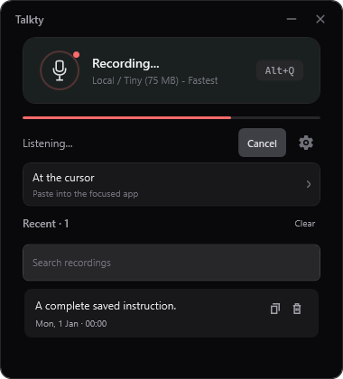
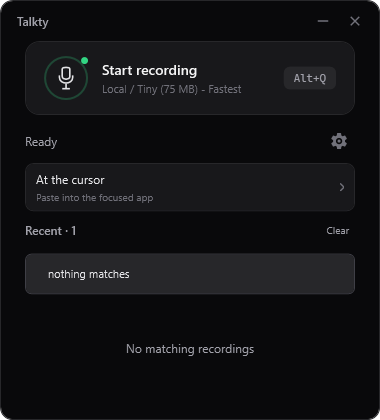

# Performance and appearance

Implemented locally on 3 October 2026 after Marko asked to complete performance, optimization and appearance work beyond the capture integration. No installed binary, app setting, model choice or running process was changed.

Delivery follow-up: this source is included in the public Talkty 1.5.0 release.
Current package and PC installation status are recorded in [the release record](RELEASE-1.5.0.md).
The measurements below describe the implementation check and do not establish
installed microphone behavior or a new overall transcription speed distribution.

## Performance evidence and changes

The installed session log was read with FileShare.ReadWrite at 16:24:45. It contains 584 stop-to-paste timings: median 839 ms, 95th percentile 2,402 ms, maximum 25,814 ms. Of 209 cycles with early recognition,8 reused the result. The latest encoding/payload preparation samples were 5–33 ms. These are observations from one real session, not controlled before/after measurements or an accuracy score. Private speech/audio was not replayed or copied into this report.

Two changes target app-owned overhead while preserving Marko's full-recording accuracy requirement:

1. The microphone service now checks the quiet tail under its existing data lock using a span. The same 1,600-sample windows, RMS threshold and final samples are examined; no float array is copied for each pause poll. Interface fallbacks retain compatibility with existing test/alternate services.
2. While an early whole-take decode is running, the scheduler checks whether speech resumed. It cancels obsolete work before the eventual stop hotkey, then awaits decoder unwind. Local later pauses may retry within the existing three-pass bound; cloud still permits at most one early call. An exact matching final take still waits for/reuses its full result. Changed audio, failures and cancellation still use the established full final pass. No model, audio quality, phrase splitting or partial publication changed.

The real buffer microbenchmark runs 1,000 cloud-sized pause polls of 12,800 samples:

| Measurement | Prior tail-copy path | New span path |
| --- | ---: | ---: |
| Allocated managed bytes | 51,224,000 | 0 |
| Committed measured run | 113.83 ms | 83.01 ms |

The timing is one warmed, old-then-new sample on a shared workstation. Confidence is high in the measured allocation removal; confidence in a general CPU percentage is moderate. It does not establish a fixed transcription speedup. Provider latency, early-call billing and whole-engine recognition performance were not benchmarked in this pass. Cancellation may reduce wasted work, but a cloud request already accepted by its provider may still be billed.

The committed benchmark output is [pause-polling.json](evidence/performance-ui-20261003/pause-polling.json). Tests use the actual AudioCaptureService with a synthetic recorder, and exercise resumed speech, matching final work after scheduling stops, exact-audio equality, late audio, cancellation and decoder serialization.

## Appearance and usability

- The recording card uses a microphone glyph, a clear state indicator and a quieter border; the selected model is explicitly labeled Local or Cloud.
- The idle audio meter is hidden. It appears while recording, so a dormant line no longer consumes attention/space.
- The output destination is a full clickable card with a chevron and a plain explanation. It correctly distinguishes cursor paste, clipboard copy, history-only output and an ADE review draft.
- History has a full-text search over the final output and original dictated text, including case-insensitive Croatian names and technical identifiers. Filtering does not truncate or rewrite stored content.
- Empty history and empty search states are separate; clearing or deleting the last entry clears the filter. Existing copy/delete/keyboard behavior and virtualized history remain.
- The main view was checked at 380 × 420, 420 × 520 and 720 × 640, with ready, recording, processing, loading and no-result states. No oversized new section or replacement design system was introduced.

## Validation and delivery

Final Release application build and full suite: 405 tests passed, 0 failed, 0 skipped. The six existing test-source warnings are unchanged; application compilation has no new warnings/errors. Focused tests cover zero-allocation pause checks, cancellation before stop, matching-result reuse, full-text search, state layout, keyboard recording actions, scaling meter and history virtualization/last-entry access. Production XAML/styles were rendered offscreen and the PNGs inspected; no desktop input, microphone or clipboard was used.

This is a source update following capture integration 2e8ffe1/a3cf517. It is not an installed or public release, and it does not demonstrate a new real-world stop-to-paste distribution. The existing coordinated-delivery task Athena-dkxi still owns package preparation and installed acceptance. The WinSnipper 0.9.0 release lane was told its completed 1e4b9e8 source was ready; this work made no WinSnipper edit.

Reproduce: `dotnet test Talkty.Tests/Talkty.Tests.csproj -c Release --no-restore`. Renders regenerate under `Talkty.Tests/bin/ui-evidence`; the measured pause output regenerates under `Talkty.Tests/bin/Release/net8.0-windows/perf-evidence`.
