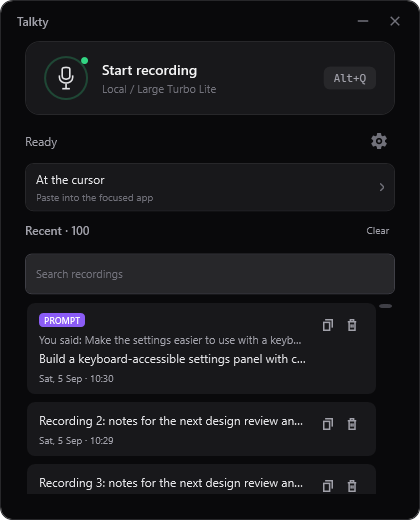

# Talkty 1.5.0

Stable Windows installation and open-source release update requested by Marko on
3 October 2026. **1.5.0 is the public Latest release. Local installation is pending
explicit permission to close the running Talkty instance**, as recorded below.

## Release notes

- The main window shows the microphone action, recording state and selected
  local/cloud model more clearly. Output is a full clickable destination card,
  with accurate cursor, clipboard, history-only or selected ADE draft feedback.
  The audio meter appears during recording.
- Search history by final text or the original spoken transcription, without
  shortening or rewriting stored entries. Empty history and no matching entries
  have separate messages. Small windows retain scrolling and virtualized history.
- Pause checks examine the existing audio buffer without allocating a copied
  tail. A focused 1,000-check benchmark eliminated 51,224,000 temporary bytes.
  Obsolete early recognition cancels when speech resumes. The selected model,
  complete take and exact-audio result reuse are preserved. This is not evidence
  of a faster overall transcription distribution.
- Optional direct dictation to a named Hephaestus ADE agent draft. The entire
  instruction is staged for review without replacing the clipboard or sending a
  turn. Recording freezes its destination. Unverified handoffs remain encrypted
  locally and retry with the same destination and operation ID.
- Command delivery uses stable operation IDs and receipt reconciliation instead
  of blindly repeating a possibly completed action after a lost response.
- Corrected the public privacy document and installer disclosure to describe
  optional cloud processing, text in logs, encrypted recovery and ADE draft delivery.

## Ecosystem requirements and privacy

Direct draft delivery requires the matching ADE protocol-v1 capture receiver
(implemented in ADE source `3f029e89`). The public ADE 0.0.108 and this PC's older
installed ADE do not include it. This Talkty release does not install ADE or Athena
Desktop and does not claim an installed hub connection. WinSnipper 0.9.0 already
contains its optional screenshot companion; screenshots and dictation meet in the
same selected unsent draft once a compatible receiver is installed.

Durable command receipts require the matching Hermes operation-receipt update
(`dc02d887b` in Athena source). Older services retain conservative uncertainty
handling rather than unsafe automatic replay. Ordinary dictation needs neither
integration. No generic terminal or Athena Desktop conversation destination is
included in this release.

Local recognition remains the default. Cloud transcription, Prompting and its
optional checks use configured external providers and can cost per request.
Cancelled early cloud recognition may already have been accepted and billed.
Direct ADE delivery shares the completed text with the explicitly selected local
agent draft; Talkty never automatically submits it. Saved uncertain capture
handoffs use Windows current-user encryption.

## Verification

Implementation source: `2e8ffe1`, source handoff `a3cf517`, performance/interface
source `0e32998`. Versioned source `1d13a1b` passed restore, Release build and all
405 tests locally on 3 October. The final documentation/license-only update
`8698fb6` changed no application, dependency or configuration input to those tests.
That result was reused for the final publish, and the exact final source independently
passed restore/build/all 405 tests in GitHub CI. Six existing test-source warnings
remain; no application compilation warnings were introduced by these changes.

Production WPF views were rendered and inspected at 380 x 420, 420 x 520 and
720 x 640, including ready, recording, transcribing, loading and no-match states.
Tests cover full-text search, keyboard actions, virtualization, exact-result reuse,
early cancellation, frozen capture destinations and encrypted delivery recovery.
No private audio was replayed and no paid model request was used for release
preparation. [Performance and appearance evidence](PERFORMANCE-APPEARANCE-2026-10-03.md).

Capture boundary and native/browser evidence:
[first capture implementation](CAPTURE-IMPLEMENTATION-2026-10-03.md).

## Package and publication evidence

- Compiled source: `8698fb6c13e27df5ffffba01d6d026f99ecabbd5`.
  [Exact-source CI 37141710292](https://github.com/v2matosevic/Talkty/actions/runs/37141710292)
  passed restore, Release build and all 405 tests.
- Fresh self-contained publish: `installer/output/release-1.5.0-final`.
  Product version `1.5.0+8698fb6c13e27df5ffffba01d6d026f99ecabbd5`.
  The manifest contains 492 files including native Opus, Vulkan and third-party
  notices, with no bundled CUDA or unsupported-platform runtimes.
- Installer: `TalktySetup-1.5.0.exe`, 61,549,032 bytes. SHA-256:
  `a0b7380a96388a338e5e7c1563d70177464c1cfebe3fae12eea464edac3a8421`.
  Inno compile succeeded with no compiler warning. Logs:
  `installer/output/build-1.5.0-verified.log` and `build-1.5.0-final.log`;
  manifest: `payload-1.5.0.csv`; checksum: `TalktySetup-1.5.0.sha256`.
- Production uninstall-code fixtures passed Keep and Remove with all four process
  exits 0. Evidence: `installer/output/uninstall-check-e2877fea0c014545841952de5e217d50/results.json`.
  They used isolated paths and no real application registration/user data.
- [Public GitHub release](https://github.com/v2matosevic/Talkty/releases/tag/v1.5.0)
  was published at 17:54:01 UTC on 3 October and marked Latest, not prerelease.
  The tag points to the exact compiled source above. Authenticated draft download
  and a fresh anonymous public download both match the installer SHA-256 and
  checksum. The anonymous Latest API and inspected public page resolve to 1.5.0.
  Evidence: `installer/output/draft-verification-1.5.0.json`,
  `public-verification-1.5.0.json` and `github-release-1.5.0.png`.
- Public `version.json` advances to 1.5.0 after that publication. The optional
  CUDA pack is version-independent and unchanged. The installer remains unsigned.

## Windows installation

- The running 1.4.0 installation at `B:/Talkty` has been backed up: 532 files,
  excluding its separate existing backup directory. Preservation snapshots cover
  55 settings/history/recovery/model files and 13 optional CUDA files. Non-model
  user data has also been backed up; large model files are hash-verified and are
  outside the installer payload. Private evidence:
  `installer/output/preservation-1.5.0.json` and `pre-1.5.0-20261003-194753`.
- Pending: explicit permission to close the running Talkty instance; official Inno
  upgrade; exit, registry, payload and preserved-data checks; normal-user relaunch
  and startup version/hotkey/model verification. This PC's existing all-users
  installation requires Windows administrator approval.

Installed microphone/desktop-input behavior and a complete clean-machine install/
uninstall are separate checks and are not established by headless tests.
