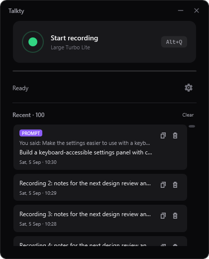

# Desktop usability and responsiveness

5 September 2026. Follow-on to the installed 1.3.1 recording reliability work in [IMPROVEMENTS-2026-09.md](IMPROVEMENTS-2026-09.md).

## Changes

- The main recording action is a real button, reachable with Tab and activated with Enter or Space. Loading and transcription disable it; recording leaves it available to stop. If the selected model is missing, it opens Settings.
- A visible Cancel action accompanies recording and transcription. Settings cannot interrupt an active dictation, and the global recording hotkey does not take over the microphone while Settings is open.
- The window defaults to 420 × 520, with a 380 × 420 minimum. Status messages truncate within their column and retain full text in a tooltip. The audio meter scales across the available width.
- History uses a recycling, virtualized list. Copy and delete remain visible, their positions stay fixed on hover, and timestamps include a date. Arrow keys select a row; Enter or Ctrl+C copies it; Delete removes it. Focused action buttons keep their own keyboard behavior.
- History previews use available width instead of a fixed character limit. Multi-line output is flattened only for display; the original text remains intact for copying and persistence.
- History saves take snapshots on the UI thread and write them in order on a worker. Clear/delete no longer race with a worker enumerating the live collection or an older save. Shutdown waits for the pending history writes.
- Meter updates coalesce while the UI is busy, retaining the latest reading. Stopping resets the meter, and microphone-test readings do not update the main dictation meter.
- The overlay says “Transcribing...” instead of “...”, and forwards completion/cancellation status. Its timer resets immediately, uses a monotonic clock, reuses one timer, and stops when hidden or closed. Display updates run four times a second instead of ten.
- Overlay bars respond deterministically to the input peak, with a square-root display curve that makes quiet input visible. This changes the meter drawing only, not recorded samples or recognition input.
- Longer overlay labels are bounded and ellipsized; resizing keeps the pill centered at its existing location and within the monitor work area.

## Verification

The combined worktree passes 99 tests in both Debug and Release, including the separate vocabulary improvement. This UX pass adds nine cases to the original 74-test baseline; the vocabulary work adds sixteen.

The production WPF XAML was rendered off-screen and visually inspected at 380 × 420, 420 × 520 and 720 × 640. The preview harness removes native window/tray creation and event-handler attachment, but uses the real styles, bindings, templates and view model. It does not open the app, record audio, inject desktop input, use cloud services, or access the system clipboard.

Observed with 100 history entries:

| Window | Realized history cards | History viewport height |
| --- | ---: | ---: |
| 380 × 420 | 3 | 147 px |
| 420 × 520 | 5 | 247 px |
| 720 × 640 | 7 | 367 px |

The previous ItemsControl created all 100 cards. These counts describe visual-element work, not a measured change in total memory or transcription speed. Tests also verify scrolling reaches entry 100.

A synthetic burst of 1,000 audio-level events on a busy dispatcher produces one visible meter update with the latest value. A blocked history-save test verifies that deleting and then clearing writes the correct snapshots in order. Timer reuse/reset, active-microphone ownership, missing-model navigation, processing labels and recording-button availability are covered.

```powershell
dotnet test Talkty.Tests/Talkty.Tests.csproj --no-restore --verbosity minimal
dotnet test Talkty.Tests/Talkty.Tests.csproj -c Release --no-restore --verbosity minimal
git diff --check
```

Test renders and layout measurements regenerate under `Talkty.Tests/bin/ui-evidence/`.



## Confidence and remaining check

Confidence: high for the tested state, persistence and layout changes. Native keyboard focus, mixed-monitor DPI and real microphone feel still need an interactive check. No recognition-accuracy or real-world inference-speed improvement is claimed for this UX pass.

After installing the combined update, allow two minutes:

1. Tab to Start recording, record a short sentence, and use the hotkey to stop. Check the timer, meter reset and transcription label.
2. Select a history row with arrow keys. Copy it with Enter, then verify its complete text in an editor. Resize the window and scroll to older entries.
3. Start another recording and click Cancel. Open Settings and test the microphone; confirm the global recording hotkey does not start dictation until Settings is closed.

Packaging and installation are coordinated with the concurrent vocabulary pass. The previously installed 1.3.1 build is distinct from this follow-on source until the combined update is installed.
